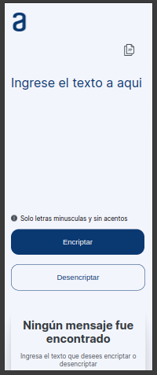
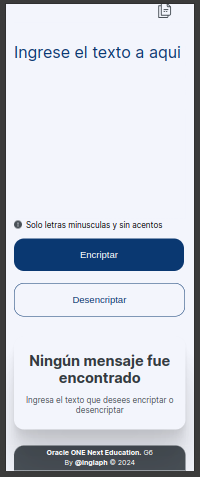
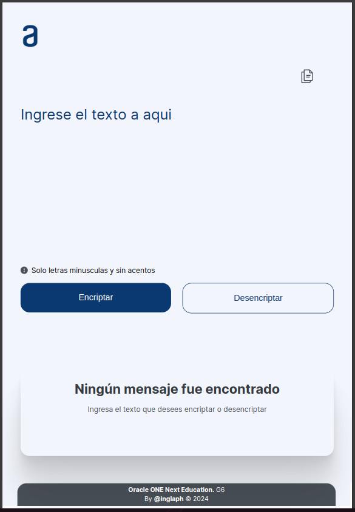
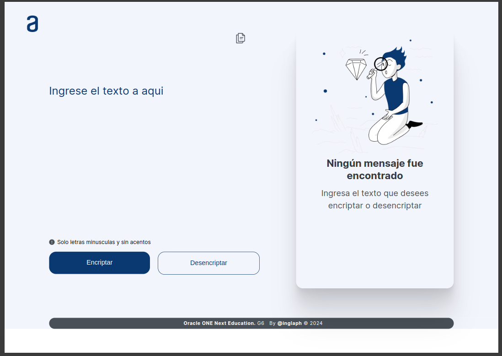

# Encriptador de Textos - ONE
by *@inglaph*  
**Oracle ONE Next Education G6**  
*2024*

___
## Tabla de Contenido

- [Encriptador de Textos - ONE](#encriptador-de-textos---one)
  - [Tabla de Contenido](#tabla-de-contenido)
  - [Planteamiento del requerimiento](#planteamiento-del-requerimiento)
      - [Requisitos:](#requisitos)
      - [Ejemplo:](#ejemplo)
      - [Extras:](#extras)
  - [Desarrollo de la Solución](#desarrollo-de-la-solución)
      - [Uso](#uso)
    - [Características](#características)
      - [Diseño](#diseño)
        - [Version Movil 375 x 933](#version-movil-375-x-933)
        - [Version Tablet Vertical  768 x 1174](#version-tablet-vertical--768-x-1174)
        - [Version Desktop](#version-desktop)
      - [Programación](#programación)
      - [Tecnologías Utilizadas](#tecnologías-utilizadas)

___
## Planteamiento del requerimiento
vamos a trabajar en una aplicación que encripta textos, así podrás intercambiar mensajes secretos con otras personas que sepan el secreto de la encriptación utilizada.

Las "llaves" de encriptación que utilizaremos son las siguientes:

`La letra "e" es convertida para "enter"`  
`La letra "i" es convertida para "imes"`  
`La letra "a" es convertida para "ai"`  
`La letra "o" es convertida para "ober"`  
`La letra "u" es convertida para "ufat"`  

#### Requisitos:

- Debe funcionar solo con letras minúsculas
- No deben ser utilizados letras con acentos ni caracteres especiales
- Debe ser posible convertir una palabra para la versión encriptada también devolver una palabra encriptada para su versión original.

#### Ejemplo:  
`"gato" => "gaitober"`  
`gaitober" => "gato"`

- La página debe tener campos para
  inserción del texto que será encriptado o desencriptado, y el usuario debe poder escoger entre as dos opciones.
- El resultado debe ser mostrado en la pantalla.

#### Extras:

- Un botón que copie el texto encriptado/desencriptado para la sección de transferencia, o sea que tenga la misma funcionalidad del `ctrl+C` o de la opción "copiar" del menú de las aplicaciones.

___

## Desarrollo de la Solución

#### Uso
Se escribe un texto en el input indicado y con el boton "Encriptar", siguiendo las normas de encriptacion, retorna el texto encriptado en el lado derecho (Desktop) o en la parte inferior (movil).
Permite revertir la encriptacion colocando el texto encriptado en el input de entrada y realizando click en el boton desencriptar.

### Características
#### Diseño
&#9989; Se desarrolla bajo la metodologia **mobile first**, donde se establecen los estilos progresivamente desde la pantalla mas pequeña hasta la mas grande.  
&#9989; Se colocan efectos visuales a los botones para la pseudo-clase **:hover**  
&#9989; Se genera la maquetacion correspondiente con el [Diseño de Figam](https://www.figma.com/file/trP3p5nEh7XUyB3n2bomjP/Alura-Challenge---Desaf%C3%ADo-1---L%C3%B3gica?type=design&node-id=0-1&mode=design&t=ETWBupcDvGRCwPAu-0)  
&#9989; &#128640; Agrego icono para pegar texto desde el *clipboard* en el input de entrada.  
&#9989; &#128640; Agrego *footer* con la informacion pertinente 

##### Version Movil 375 x 933
 

##### Version Tablet Vertical  768 x 1174

##### Version Desktop 

#### Programación
&#9989; El input de entrada convierte automaticamente a minusculas el texto recibido utilizando el evento 'input'  
&#9989; Validanda caracteres especiales utilizando **expresiones regulares**, alerta al usuario y permite la correccion del texto de entrada  
&#9989; Modifica dinamicamente desde JavaScript elementos del HTML dependiendo del estado de la aplicacion.  
&#9989; Utiliza **recusividad** para la desencriptacion  
&#9989; Utiliza la Clipboard API disponible en JavaScript para la funcion de copiado y pegado de texto

#### Tecnologías Utilizadas
- **HML**
- **CSS**
- **JavaScript**

---